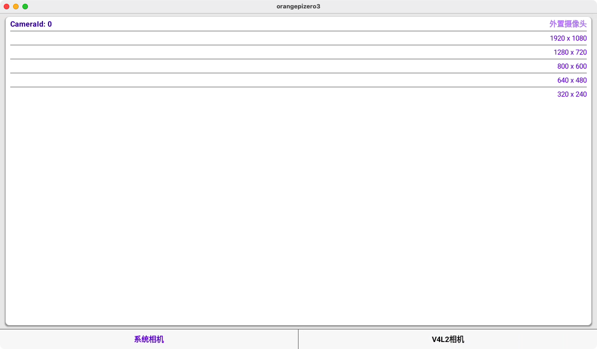
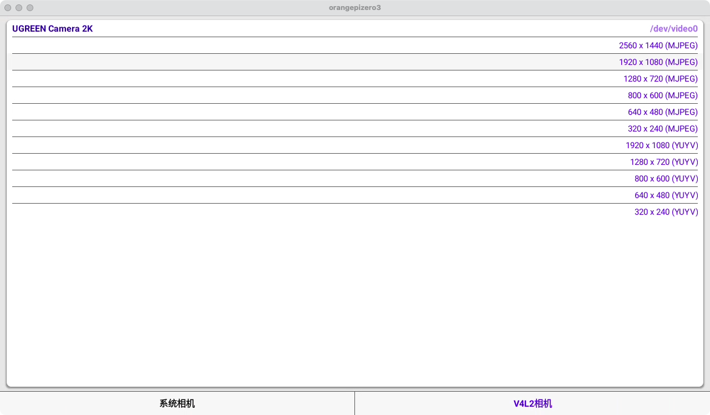
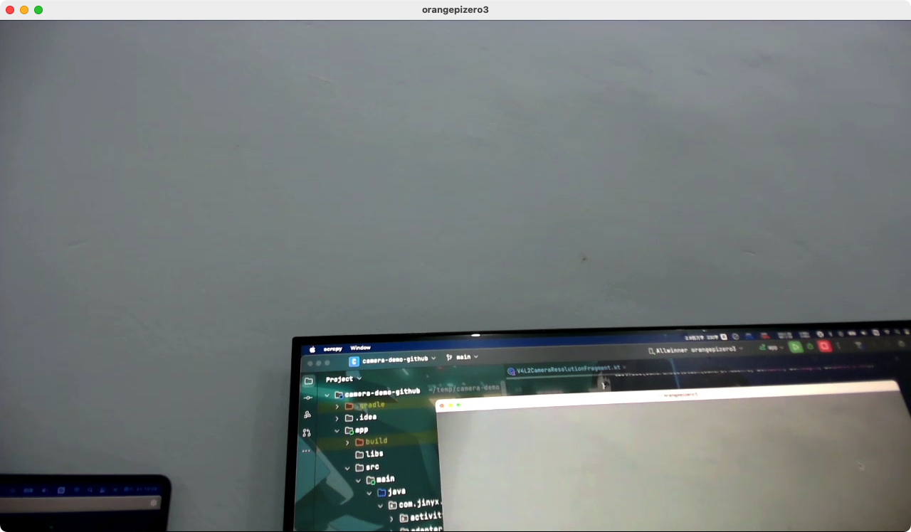

Android 相机预览 —— Camera2、V4L2Camera
--

#### [apk 下载](./imgs/app-debug.apk) 或扫码安装

- [系统相机](./libcamera-sys): 使用 Camera2 打开被系统识别的 前置、后置、外置相机

- [V4L2 相机](./libcamera-v4l2): 使用 V4L2 Camera 通过 /dev/video 节点打开 USB 相机

&emsp;&emsp;通过读取 modalias 配置查找 video 节点，需要关闭 selinux，获取 video 节点分辨率信息以及预览，需要赋予 video 节点 666 读写权限

~~~shell
adb shell
su
# getenforce  查看当前 selinux 状态，Enforcing 为开启，Permissive 为关闭
setenforce 0  # 关闭 selinux
# 修改 /dev/video 节点权限
chmod 666 /dev/video*
~~~

&emsp;&emsp;示例代码中增加拍照功能，系统相机返回 NV21 格式图像数据；V4L2 相机返回 MJPEG、YUYV 也同样提供接口转成 NV21；[nv21 转 bitmap 保存](./app/src/main/java/com/jinyx/camera/image/ImageHelper.kt)

&emsp;&emsp;如果需要保存视频数据，可考虑使用 [javacv](https://github.com/bytedeco/javacv) 进行图像帧录制，将 NV21 转 Frame
